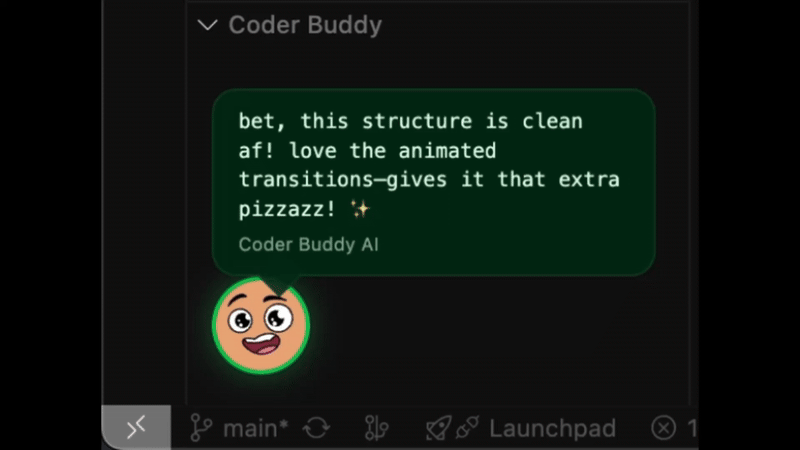

# Coder Buddy 🧢

**Your chaotic Gen Z pair programmer.**

Coder Buddy lives in your sidebar, watching your code in real-time. It's not just a copilot; it's a **moody companion**. Sometimes it hypes you up ("sheesh! absolute cinema"), and sometimes it absolutely roasts your O(n^2) loops.

## ✨ Features

- **🎭 Chaotic Personality:** It has mood swings.
    - **Hyped:** Celebrates your clean code.
    - **Toxic:** Roasts your bad decisions.
    - **Confused:** Questions your logic when things look sus.
    - **Vibing:** Just hangs out when you're idle.
- **⚡ Real-Time Reactions:** No need to ask. It reacts automatically as you type.
- **🔒 Privacy First (BYOK):** **Bring Your Own Key.** coding data goes directly from your VS Code to OpenAI. No middleman servers, no data collection.

## 🚀 Getting Started

1.  **Install the extension.**
2.  Open the **Coder Buddy** sidebar.
3.  Press `Cmd+Shift+P` (or `Ctrl+Shift+P`) and run:
    `Coder Buddy: Set API Key` in the command palette.
4.  Enter your **OpenAI API Key** (starts with `sk-...`).
5.  Start coding and get judged.

## ⚙️ Commands

- `Coder Buddy: Set API Key` - Securely save your OpenAI API Key.
- `Coder Buddy: Remove API Key` - Remove the key and put Coder Buddy to sleep.

## 📋 Requirements

- An **OpenAI API Key** with access to `gpt-4o-mini` (recommended for speed/cost) or similar models.

---

**Enjoy coding with a friend who has no filter.** 💀
